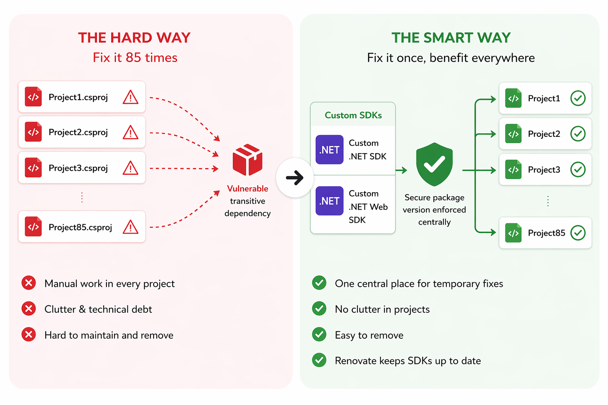

# Centralized .NET SDK Configuration Using Internal SDK Wrappers

## Overview

This document describes a centralized approach for managing .NET build configuration using internal SDK wrappers distributed as NuGet packages. The primary goal is to centralize build configuration and transitive dependency management, allowing specific dependency versions to be enforced consistently across all repositories from a single location. This reduces duplication across repositories by consolidating shared build logic and dependency configuration.
This document describes a centralized approach for managing .NET build configuration using internal SDK wrappers distributed as NuGet packages. The approach reduces duplication across repositories by consolidating shared build logic and dependency configuration.



## Architecture

Three SDK layers are used:

* Sdk: wrapper around Microsoft.NET.Sdk
* Sdk.Web: wrapper around Microsoft.NET.Sdk.Web
* Sdk.Shared: shared configuration imported by both wrappers

Sdk and Sdk.Web act as thin abstraction layers over the official .NET SDKs. Shared configuration is defined once in Sdk.Shared and imported by both SDK variants.

## Repository structure

```
Sdk/
Sdk.Web/
Sdk.Shared/
```

Each SDK contains:

* props file (build properties)
* targets file (build rules and package references)

## Props configuration

Example props import: `Sdk/Sdk.props`
```xml 
<Project>
  <Import Project="Sdk.props" Sdk="Microsoft.NET.Sdk" />
  <Import Project="MyTeam.Shared.props" />
</Project>
```


Sdk.Web uses Microsoft.NET.Sdk.Web: `Sdk.Web/Sdk.props`
```xml
<Project>
  <Import Project="Sdk.props" Sdk="Microsoft.NET.Sdk.Web" />
  <Import Project="MyTeam.Shared.props" />
</Project>
```

The shared props: `Sdk.Shared/MyTeam.shared.props`
```xml
<Project>
  <PropertyGroup>
    <TreatWarningsAsErrors>true</TreatWarningsAsErrors>
    <ImplicitUsings>enable</ImplicitUsings>
    <Nullable>enable</Nullable>
  </PropertyGroup>
</Project>
```

## Targets configuration

Example targets import:
```xml
<Project>
  <Import Project="Sdk.targets" Sdk="Microsoft.NET.Sdk" />
  <Import Project="MyTeam.Shared.targets" />
</Project>
```

Sdk.Web uses the same structure with Microsoft.NET.Sdk.Web.

The shared targets: `Sdk.Shared/MyTeam.shared.targets`

```xml
<Project>
  <PropertyGroup>
    <NoWarn>$(NoWarn);NU1510;CA1873</NoWarn>
  </PropertyGroup>

  <!-- Force mimimum versions of certain transitive dependencies -->
  <ItemGroup>
    <PackageReference Include="System.Security.Cryptography.Xml" Version="10.0.7" Visible="false" PrivateAssets="all" AllowPruning="false" />
    <PackageReference Include="Microsoft.AspNetCore.DataProtection" Version="10.0.7" Visible="false" PrivateAssets="all" AllowPruning="false" />
  </ItemGroup>
</Project>
```

This centralizes warning configuration and enforcing mimimum package versions of transitive  dependencies.

## Packaging & publishing

SDKs are distributed as NuGet packages using a nuspec definition.

### Nuspec file

```xml
<?xml version="1.0" encoding="utf-8"?>
<package xmlns="http://schemas.microsoft.com/packaging/2012/06/nuspec.xsd">
  <metadata>
    <id>MyTeam.Sdk</id>
    <version>$version$</version>
    <authors>MyTeam</authors>
    <description>Centrale build configuratie</description>
    <repository type="git" url="https://gitlab.ic.uva.nl/myteam/libraries/myteam.sdk" />
    <readme>docs\readme.md</readme>
    <dependencies />
  </metadata>

  <files>
    <file src="Sdk\**" target="Sdk\" />
    <file src="Shared\**" target="Sdk\" />
    <file src="..\README.md" target="docs\readme.md" />
  </files>
</package>
```

### Build and publish

Package creation:

```
dotnet pack src/MyTeam.Sdk.nuspec /p:Version=1.2.3
```

Package publishing:

```
dotnet nuget push MyTeam.Sdk.Web.1.2.3.nupkg --api-key myapikey --source https://mynugetserver
```

## Usage

Projects reference the SDK via the Sdk attribute.

Before:

```xml
<Project Sdk="Microsoft.NET.Sdk">
```

After:

```xml
<Project Sdk="MyTeam.Sdk.Web/1.2.3">
```

## Result

* Centralized build configuration
* Reduced duplication across repositories
* Consistent compiler and dependency settings
* Controlled distribution via NuGet

## Summary

The approach replaces per-repository configuration with versioned SDK wrappers. Shared build logic and transitive dependency management are defined once and distributed as a package. This allows central enforcement of dependency versions, including transitive dependencies, ensuring consistent behavior across all consuming projects.

Renovate handles dependency updates for the SDK packages, ensuring that when a new SDK version is published, updates are automatically propagated to consuming repositories.
The approach replaces per-repository configuration with versioned SDK wrappers. Shared build logic and transitive dependency management are defined once and distributed as a package. This allows central enforcement of dependency versions, including transitive dependencies, ensuring consistent behavior across all consuming projects.

The approach replaces per-repository configuration with versioned SDK wrappers. Shared build logic is defined once and distributed as a package, ensuring consistent behavior across all consuming projects.
